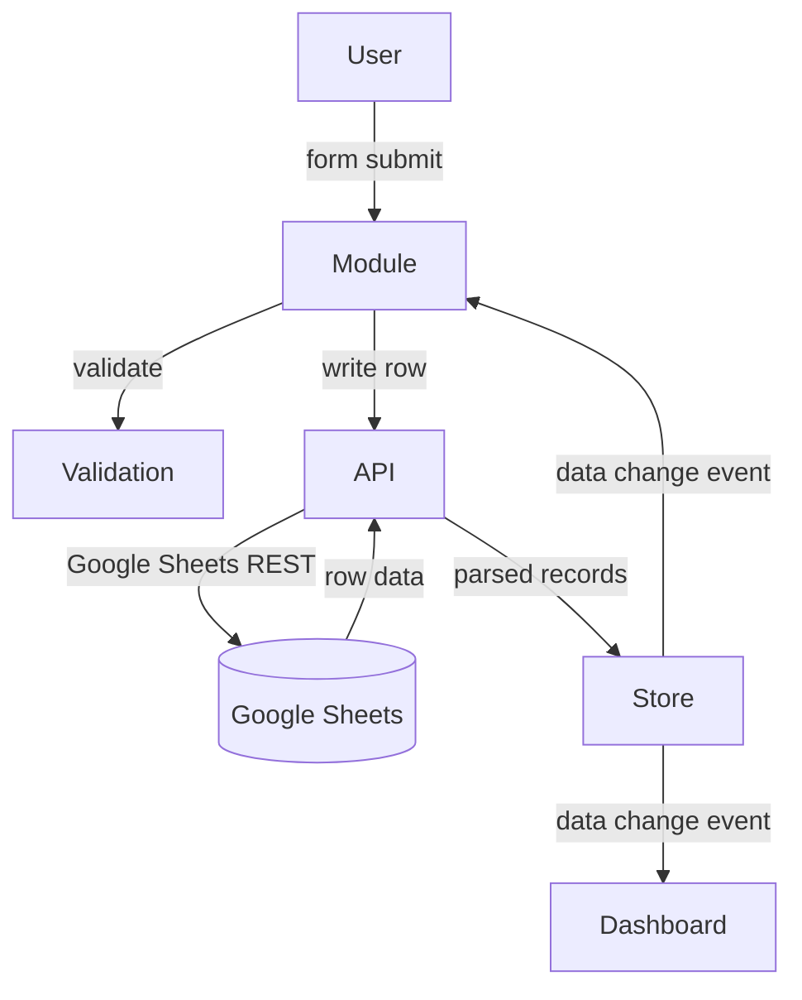

# Design Document: Expense Portal

## Overview

The Expense Portal is a client-side single-page application (SPA) built with HTML, CSS, Bootstrap 5, and vanilla JavaScript. It provides a personal finance management interface where users can log expenses and income, manage accounts and credit cards, set budgets and savings goals, record transfers, and track vehicle mileage — all persisted in a Google Sheets spreadsheet via the Google Sheets REST API.

There is no backend server. All data operations go directly from the browser to the Google Sheets API using an API key. Chart.js renders all charts. Navigation is tab-based within a single HTML page.

### Key Design Decisions

- **Google Sheets as database**: Each data type maps to a dedicated sheet tab. Rows are appended for new records; full-range reads retrieve all records. This avoids a backend while keeping data portable and human-readable.
- **API key authentication**: The app uses a read/write API key stored in a config object at startup. This is appropriate for personal-use tools where the spreadsheet is private and the key is not publicly exposed.
- **Client-side filtering and aggregation**: All filtering, sorting, and dashboard calculations happen in-browser after fetching data. This keeps the architecture simple and avoids complex query logic.
- **Module pattern**: Each major feature area is a JavaScript module (IIFE or ES module) with a clear public API, keeping concerns separated without a build tool.

---

## Architecture

The application is a single `index.html` file that loads CSS and JS dependencies. JavaScript is organized into modules loaded as `<script type="module">` tags or concatenated files.

```
index.html
├── css/
│   └── styles.css
├── js/
│   ├── config.js          # API key, spreadsheet ID, sheet names
│   ├── api.js             # Google Sheets API client (all read/write)
│   ├── store.js           # In-memory data store + event bus
│   ├── validation.js      # Shared form validation helpers
│   ├── utils.js           # Date formatting, number formatting, etc.
│   ├── expenses.js        # Expense entry + listing module
│   ├── income.js          # Income entry + listing module
│   ├── accounts.js        # Account & credit card management
│   ├── budgets.js         # Budget management
│   ├── savings.js         # Savings goals
│   ├── transfers.js       # Account-to-account transfers
│   ├── vehicles.js        # Vehicle trip logs + vehicle expenses
│   └── dashboard.js       # Dashboard summaries + charts
└── index.html
```

### Data Flow



### Tab Navigation

The SPA uses Bootstrap tabs. Each tab corresponds to one module:

| Tab | Module |
|-----|--------|
| Dashboard | dashboard.js |
| Expenses | expenses.js |
| Income | income.js |
| Accounts | accounts.js |
| Budgets | budgets.js |
| Savings Goals | savings.js |
| Transfers | transfers.js |
| Vehicles | vehicles.js |

---

## Components and Interfaces

### config.js

Holds the single configuration object read at startup.

```js
const CONFIG = {
  apiKey: '',           // Google Sheets API key
  spreadsheetId: '',    // Target spreadsheet ID
  sheets: {
    expenses:    'Expenses',
    income:      'Income',
    accounts:    'Accounts',
    creditCards: 'CreditCards',
    budgets:     'Budgets',
    savings:     'SavingsGoals',
    transfers:   'Transfers',
    tripLogs:    'VehicleTripLogs',
    vehicleExp:  'VehicleExpenses',
  }
};
```

If `apiKey` or `spreadsheetId` is empty at startup, the app displays a configuration error and disables all forms and the dashboard.

### api.js — API Client

All Google Sheets communication is encapsulated here. No other module calls `fetch` directly.

```js
// Public interface
async function appendRow(sheetName, rowValues): Promise<void>
async function fetchRows(sheetName): Promise<string[][]>
```

- `appendRow` uses the Sheets `values.append` endpoint with `valueInputOption=USER_ENTERED`.
- `fetchRows` uses the `values.get` endpoint on the full sheet range.
- All requests include a 10-second `AbortController` timeout. If exceeded, the promise rejects with a timeout error.
- HTTP errors (non-2xx) and network errors are caught and re-thrown as structured `ApiError` objects: `{ code, message }`.

### store.js — In-Memory Store + Event Bus

After each fetch, parsed records are stored in memory. Modules subscribe to change events to re-render.

```js
// State shape
const state = {
  expenses: [],
  income: [],
  accounts: [],
  creditCards: [],
  budgets: [],
  savings: [],
  transfers: [],
  tripLogs: [],
  vehicleExpenses: [],
};

function set(key, records): void       // replace collection, emit event
function get(key): record[]            // read collection
function on(key, callback): void       // subscribe to changes
function off(key, callback): void      // unsubscribe
```

### validation.js

Shared validation helpers used by all form modules.

```js
function requireFields(formData, fields): ValidationResult
function requirePositiveNumber(value): ValidationResult
function requireFutureDate(dateStr): ValidationResult
function requireDifferentValues(a, b, label): ValidationResult

// ValidationResult: { valid: boolean, errors: string[] }
```

### Module Interface Pattern

Each feature module (expenses, income, accounts, etc.) exposes:

```js
{
  init(): void,       // bind DOM events, subscribe to store
  render(): void,     // re-render the list/table from store
  resetForm(): void,  // clear form fields
}
```

### dashboard.js

Subscribes to all store keys. On any change, recalculates and re-renders:
- Monthly totals (income, expenses, net balance)
- Category breakdown
- Source breakdown
- Budget vs actual per category
- Credit card utilization progress bars
- Chart.js instances: pie/doughnut (category spend), bar (6-month income vs expense), credit card utilization

Chart instances are stored in module scope and updated via `chart.data = ...; chart.update()` to avoid re-creating canvas elements.

---

## Data Models

Each record type maps directly to a Google Sheets row. Column order is fixed and documented here.

### ExpenseRecord

| Column | Field | Type |
|--------|-------|------|
| A | date | ISO date string (YYYY-MM-DD) |
| B | category | string |
| C | amount | number (stored as string) |
| D | description | string |
| E | paymentMethod | string (account or card name) |

### IncomeRecord

| Column | Field | Type |
|--------|-------|------|
| A | date | ISO date string |
| B | source | string |
| C | amount | number (stored as string) |
| D | description | string |

### Account

| Column | Field | Type |
|--------|-------|------|
| A | id | UUID string |
| B | name | string |
| C | type | string (savings / checking / cash wallet) |

### CreditCard

| Column | Field | Type |
|--------|-------|------|
| A | id | UUID string |
| B | name | string |
| C | creditLimit | number (stored as string) |

### BudgetRecord

| Column | Field | Type |
|--------|-------|------|
| A | id | UUID string |
| B | category | string |
| C | monthlyLimit | number (stored as string) |
| D | month | string (YYYY-MM) |

### SavingsGoal

| Column | Field | Type |
|--------|-------|------|
| A | id | UUID string |
| B | name | string |
| C | targetAmount | number (stored as string) |
| D | targetDate | ISO date string |
| E | savedAmount | number (stored as string) |

### TransferRecord

| Column | Field | Type |
|--------|-------|------|
| A | id | UUID string |
| B | date | ISO date string |
| C | sourceAccount | string (account name) |
| D | destinationAccount | string (account name) |
| E | amount | number (stored as string) |
| F | description | string |

### VehicleTripLog

| Column | Field | Type |
|--------|-------|------|
| A | id | UUID string |
| B | date | ISO date string |
| C | distance | number (stored as string) |
| D | fuelCost | number (stored as string) |
| E | purpose | string |

### VehicleExpenseRecord

| Column | Field | Type |
|--------|-------|------|
| A | id | UUID string |
| B | date | ISO date string |
| C | expenseType | string |
| D | amount | number (stored as string) |
| E | description | string |

### Serialization / Deserialization

Each module owns `serialize(record): string[]` and `deserialize(row: string[]): record` functions. These are the only functions that touch raw row arrays. All other code works with typed record objects.

```js
// Example for ExpenseRecord
function serialize(r) {
  return [r.date, r.category, String(r.amount), r.description, r.paymentMethod];
}
function deserialize(row) {
  return { date: row[0], category: row[1], amount: parseFloat(row[2]), description: row[3], paymentMethod: row[4] };
}
```


---

## Correctness Properties

*A property is a characteristic or behavior that should hold true across all valid executions of a system — essentially, a formal statement about what the system should do. Properties serve as the bridge between human-readable specifications and machine-verifiable correctness guarantees.*

### Property 1: Missing required fields are rejected

*For any* form submission where one or more required fields are empty or whitespace-only, the validation function should return an invalid result containing an error message identifying each missing field, and no API call should be made.

**Validates: Requirements 1.4, 6.3, 11.5, 13.3, 14.3, 15.3, 16.3, 16.7**

### Property 2: Non-positive amounts are rejected

*For any* amount value that is non-numeric, zero, or negative, the validation function should return an invalid result, and no API call should be made.

**Validates: Requirements 1.5, 1.6, 6.4, 6.5, 11.6, 13.4, 14.4, 15.4, 16.4**

### Property 3: Past target dates are rejected for savings goals

*For any* target date string that represents a date earlier than today, the savings goal validation function should return an invalid result.

**Validates: Requirements 14.5**

### Property 4: Same source and destination transfer is rejected

*For any* transfer form submission where the source account and destination account are the same value, the validation function should return an invalid result.

**Validates: Requirements 15.5**

### Property 5: All record types round-trip through serialization

*For any* valid record of type ExpenseRecord, IncomeRecord, Account, CreditCard, BudgetRecord, SavingsGoal, TransferRecord, VehicleTripLog, or VehicleExpenseRecord, calling `deserialize(serialize(record))` should produce a record that is deeply equal to the original.

**Validates: Requirements 5.4, 10.3, 11.8, 13.9, 14.9, 15.9, 16.11**

### Property 6: Records are displayed sorted by date descending

*For any* non-empty collection of records that have a date field, the rendered list order should have each record's date greater than or equal to the date of the record that follows it.

**Validates: Requirements 2.6, 7.5, 15.8, 16.8, 16.9**

### Property 7: Category filter returns only matching records

*For any* set of expense records and any non-empty set of selected categories, the filtered result should contain exactly those records whose category is in the selected set — no more, no fewer.

**Validates: Requirements 3.2**

### Property 8: Date range filter returns only records within range

*For any* set of records and any valid date range [start, end] where start <= end, the filtered result should contain exactly those records whose date falls within [start, end] inclusive.

**Validates: Requirements 3.4, 8.4**

### Property 9: Clearing filters restores all records

*For any* set of records, applying any combination of filters and then clearing all filters should result in the full original set being displayed.

**Validates: Requirements 3.5, 8.5**

### Property 10: Dashboard monthly expense total equals sum of current-month expense amounts

*For any* set of expense records, the dashboard's displayed monthly expense total should equal the arithmetic sum of the `amount` fields of all records whose date falls within the current calendar month.

**Validates: Requirements 4.1, 9.2**

### Property 11: Dashboard monthly income total equals sum of current-month income amounts

*For any* set of income records, the dashboard's displayed monthly income total should equal the arithmetic sum of the `amount` fields of all records whose date falls within the current calendar month.

**Validates: Requirements 9.1**

### Property 12: Net balance equals total income minus total expenses

*For any* set of income records and expense records for the current month, the displayed net balance should equal the sum of income amounts minus the sum of expense amounts.

**Validates: Requirements 9.3**

### Property 13: Income per source breakdown correctly sums amounts

*For any* set of income records, the source breakdown should group records by source and each group's total should equal the sum of `amount` for all records with that source.

**Validates: Requirements 9.6**

### Property 14: Category spending breakdown correctly sums amounts

*For any* set of expense records, the category breakdown should group records by category and each group's total should equal the sum of `amount` for all records with that category.

**Validates: Requirements 4.2**

### Property 15: Credit card outstanding balance equals sum of matching expenses

*For any* credit card and any set of expense records, the computed outstanding balance for that card should equal the sum of `amount` for all expense records whose `paymentMethod` equals that card's name.

**Validates: Requirements 12.1, 12.4**

### Property 16: Credit card utilization equals balance divided by credit limit

*For any* credit card with a positive credit limit and a computed outstanding balance, the utilization percentage should equal `(balance / creditLimit) * 100`, rounded to two decimal places.

**Validates: Requirements 12.2**

### Property 17: Credit card at or over limit triggers warning

*For any* credit card where the outstanding balance is greater than or equal to the credit limit, the utilization display should include a warning indicator.

**Validates: Requirements 12.5**

### Property 18: Budget vs actual correctly computes actual spending per category per month

*For any* budget record and any set of expense records, the actual spending shown alongside that budget should equal the sum of `amount` for all expense records whose category matches the budget's category and whose date falls within the budget's applicable month.

**Validates: Requirements 13.5, 13.8**

### Property 19: Budget warning shown when actual spending reaches 80% of limit

*For any* budget record where actual spending is greater than or equal to 80% of the monthly limit, the budget display should include a warning indicator.

**Validates: Requirements 13.6**

### Property 20: Budget exceeded indicator shown when actual spending exceeds limit

*For any* budget record where actual spending is strictly greater than the monthly limit, the budget display should include an exceeded indicator.

**Validates: Requirements 13.7**

### Property 21: Savings goal progress and remaining amount are correctly computed

*For any* savings goal, the displayed progress percentage should equal `(savedAmount / targetAmount) * 100` and the remaining amount should equal `targetAmount - savedAmount`.

**Validates: Requirements 14.6**

### Property 22: Savings goal completion indicator shown when saved amount meets target

*For any* savings goal where `savedAmount >= targetAmount`, the display should include a completion indicator.

**Validates: Requirements 14.8**

### Property 23: Transfer amounts are excluded from expense and income totals

*For any* set of transfer records alongside expense and income records, the dashboard's total expense and total income values should be identical whether or not the transfer records are present.

**Validates: Requirements 15.7**

### Property 24: Payment method dropdown options match saved accounts and credit cards

*For any* set of saved accounts and credit cards, the options rendered in the expense form's payment method dropdown should contain exactly one entry per account and one entry per credit card — no more, no fewer.

**Validates: Requirements 1.2**

### Property 25: Vehicle monthly summary correctly aggregates current-month records

*For any* set of vehicle trip logs and vehicle expense records, the monthly summary should display the sum of `distance`, the sum of `fuelCost` from trip logs, and the sum of `amount` from vehicle expense records, all filtered to the current calendar month.

**Validates: Requirements 16.10**

---

## Error Handling

### API Errors

All API errors are caught in `api.js` and re-thrown as `ApiError` objects with a `code` and `message`. Modules catch these and display user-facing error banners using a shared `showError(message)` utility.

| Scenario | Behavior |
|----------|----------|
| Missing/invalid API key at startup | Configuration error banner shown; all forms and dashboard disabled |
| Fetch error (network, HTTP 4xx/5xx) | Error banner shown; no partial data rendered; existing data preserved |
| Save error | Error banner shown; form input retained so user can retry |
| Request timeout (>10s) | Treated as a fetch/save error; timeout message shown |

### Form Validation Errors

Validation errors are displayed inline next to the relevant field using Bootstrap's `is-invalid` / `invalid-feedback` pattern. The form is not submitted until all validation passes.

### Empty States

Each list/table renders an empty state message when the data collection is empty. Dashboard shows zero values and empty chart states.

---

## Testing Strategy

### Dual Testing Approach

Both unit tests and property-based tests are required. They are complementary:
- Unit tests cover specific examples, integration points, and error conditions.
- Property-based tests verify universal correctness across many generated inputs.

### Property-Based Testing

**Library**: [fast-check](https://github.com/dubzzz/fast-check) (JavaScript, runs in browser or Node.js)

Each correctness property defined above must be implemented as a single property-based test using fast-check arbitraries. Tests must run a minimum of 100 iterations each.

**Tag format for each test**:
```
// Feature: expense-portal, Property N: <property_text>
```

Example:
```js
// Feature: expense-portal, Property 5: All record types round-trip through serialization
test('ExpenseRecord round-trip', () => {
  fc.assert(fc.property(
    fc.record({ date: fc.string(), category: fc.string(), amount: fc.float({ min: 0.01 }), description: fc.string(), paymentMethod: fc.string() }),
    (record) => {
      expect(deserialize(serialize(record))).toEqual(record);
    }
  ), { numRuns: 100 });
});
```

### Unit Tests

Unit tests cover:
- Specific examples of valid form submissions
- API client initialization with valid and invalid config
- Error banner rendering on API failure
- Empty state rendering
- Dashboard recalculation after data update
- Date range validation edge case (end < start)
- Savings goal target date in the past

### Test File Organization

```
tests/
├── validation.test.js      # Properties 1-4
├── serialization.test.js   # Property 5
├── sorting.test.js         # Property 6
├── filtering.test.js       # Properties 7-9
├── dashboard.test.js       # Properties 10-14, 18-20, 23, 25
├── creditCards.test.js     # Properties 15-17
├── savings.test.js         # Properties 21-22
├── transfers.test.js       # Properties 23-24
└── api.test.js             # Unit tests for API client, config, error handling
```
