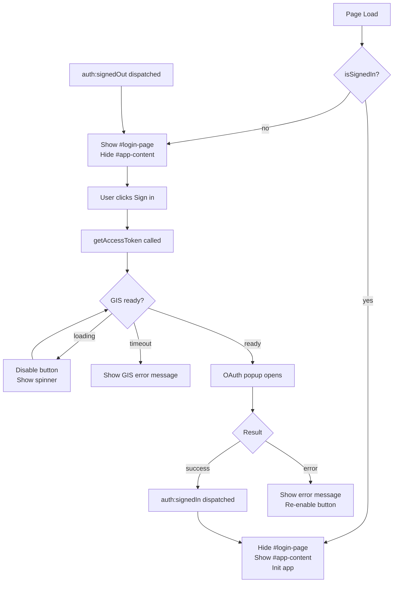

# Design Document: Google Login Page

## Overview

This feature replaces the existing sticky auth banner in the Expense Portal with a dedicated full-screen login page. The login page serves as the sole entry point for unauthenticated users, presenting the app branding and a single "Sign in with Google" button. On successful OAuth 2.0 authentication the login page fades out and the main app content is revealed. The inverse happens on sign-out.

The implementation is intentionally minimal: no new modules are introduced. A new `js/login.js` module orchestrates the login page lifecycle, and `index.html` gains the login page markup. The existing `js/auth.js` API (`initAuth`, `getAccessToken`, `isSignedIn`, `signOut`) and its custom DOM events (`auth:signedIn`, `auth:signedOut`) are used without modification.

---

## Architecture

The feature follows the existing vanilla-JS, event-driven pattern already used by the app.



**Key design decisions:**

- `#login-page` and `#app-content` are sibling elements in `index.html`. Visibility is toggled via CSS classes (`d-none`) rather than `display` style attributes, keeping logic in one place.
- `js/login.js` is the single owner of login page state. It listens for `auth:signedIn` and `auth:signedOut` on `document` and drives all transitions.
- The existing `#auth-banner` is removed from `index.html`; its sign-in button responsibility moves to the new login page.
- App initialisation (currently triggered after sign-in) is called from `login.js` once `auth:signedIn` fires, ensuring `#app-content` is fully ready before it becomes visible.

---

## Components and Interfaces

### `#login-page` (HTML element)

A full-viewport `<div>` inserted before `#app-content` in `index.html`.

Structure:
```
#login-page
  .login-card
    .login-brand          ← 💰 icon + "Expense Portal" heading + tagline
    #login-error          ← dismissible alert, hidden by default
    #sign-in-btn          ← "Sign in with Google" button
    #login-spinner        ← Bootstrap spinner, hidden by default
```

Accessibility requirements:
- `#login-page` has `role="main"` and `aria-label="Sign in to Expense Portal"`
- `#sign-in-btn` has `aria-describedby` pointing to `#login-error` when an error is visible
- `#login-error` has `role="alert"` and `aria-live="assertive"`
- Sign-in button is reachable via Tab; activatable via Enter and Space (native `<button>`)

### `js/login.js` (new module)

Exported interface:

```js
/**
 * Initialises the login page controller.
 * Must be called once from the main entry point (index.html inline script or main.js).
 */
export async function initLoginPage(): Promise<void>
```

Internal responsibilities:
- On load: check `isSignedIn()` → show correct view
- Attach click handler to `#sign-in-btn` → call `getAccessToken(false)`
- Listen for `auth:signedIn` → transition to app
- Listen for `auth:signedOut` → transition to login page, clear error state
- Handle GIS loading state (disable button, show spinner)
- Handle OAuth errors (display message, re-enable button)
- Handle GIS timeout error (display connection error message)

### `js/auth.js` (unchanged)

Used as-is. Relevant exports consumed by `login.js`:

| Export | Usage |
|---|---|
| `initAuth()` | Called once on page load before checking sign-in state |
| `getAccessToken(silent)` | Called with `silent=false` on button click |
| `isSignedIn()` | Called on page load to decide initial view |
| `auth:signedIn` event | Triggers transition to app content |
| `auth:signedOut` event | Triggers transition back to login page |

### `css/styles.css` (additions)

New CSS block `/* -- Login Page */` added at the end of the file:
- `.login-page` — full-viewport flex container, gradient background matching sidebar (`#1a1f36` → `#252b47`)
- `.login-card` — centered white card with `--card-radius`, `--shadow-lg`
- `.login-brand` — brand icon sizing and spacing
- Responsive adjustments for narrow viewports (≥ 320px)

---

## Data Models

No new persistent data structures are introduced. The login page is purely presentational and delegates all token state to `auth.js` / `localStorage`.

Relevant existing state (owned by `auth.js`):

| Key | Storage | Description |
|---|---|---|
| `ep_access_token` | `localStorage` | OAuth 2.0 access token string |
| `ep_token_expiry` | `localStorage` | Unix ms timestamp of token expiry |

Login page transient UI state (in-memory only, owned by `login.js`):

| Variable | Type | Description |
|---|---|---|
| `_loading` | `boolean` | True while GIS is loading or OAuth request is in flight |
| `_error` | `string \| null` | Current error message to display, or null |

---

## Correctness Properties

*A property is a characteristic or behavior that should hold true across all valid executions of a system — essentially, a formal statement about what the system should do. Properties serve as the bridge between human-readable specifications and machine-verifiable correctness guarantees.*


### Property 1: Login/App mutual exclusivity

*For any* application state, the login page and app content are mutually exclusive: exactly one of `#login-page` and `#app-content` is visible at any time. When no valid session exists on load, `#login-page` is visible and `#app-content` is hidden; when a valid session exists, the inverse holds.

**Validates: Requirements 1.1, 1.5, 3.2**

### Property 2: Sign-in button triggers auth request

*For any* click on the `#sign-in-btn` when it is enabled, `getAccessToken(false)` must be called exactly once on the Auth_Module.

**Validates: Requirements 2.1**

### Property 3: Button disabled while loading

*For any* state where a sign-in request is in progress (`_loading === true`), the `#sign-in-btn` element must have the `disabled` attribute set.

**Validates: Requirements 2.4**

### Property 4: Sign-in / sign-out round trip

*For any* sequence of `auth:signedIn` followed by `auth:signedOut` events, the final state must be identical to the initial unauthenticated state: `#login-page` visible, `#app-content` hidden.

**Validates: Requirements 3.1, 5.1**

### Property 5: App initialised before shown

*For any* `auth:signedIn` event, the app initialisation function must complete before `#app-content` transitions from hidden to visible.

**Validates: Requirements 3.3**

### Property 6: Error state correctness

*For any* error returned by `getAccessToken`, the `#login-error` element must be visible with a non-empty message string, and `#sign-in-btn` must not be disabled.

**Validates: Requirements 4.1, 4.3**

### Property 7: Sign-out clears error state

*For any* `auth:signedOut` event dispatched after an error was displayed, the `#login-error` element must be hidden and contain no residual error text.

**Validates: Requirements 5.2**

### Property 8: ARIA attributes present

*For any* render of the login page, `#login-page` must have `role="main"`, `#login-error` must have `role="alert"` and `aria-live="assertive"`, and `#sign-in-btn` must have a non-empty accessible label.

**Validates: Requirements 6.4**

---

## Error Handling

| Scenario | Detection | User-facing message | Recovery |
|---|---|---|---|
| GIS script fails to load within 10 s | `waitForGIS()` rejects | "Could not load Google Sign-In. Please check your internet connection." | Button re-enabled; user can retry |
| OAuth popup closed by user | `response.error === 'popup_closed_by_user'` | "Sign-in was cancelled. You can try again whenever you're ready." | Button re-enabled |
| Generic OAuth error | Any other `response.error` value | "Sign-in failed: `<error code>`. Please try again." | Button re-enabled |
| `initAuth()` called without `clientId` | `auth.js` logs a warning | No UI error (silent — developer misconfiguration) | N/A |

All error messages are displayed in `#login-error` (Bootstrap `alert-danger`). The alert includes a dismiss button (`×`) so the user can clear it. Errors are cleared automatically when a new sign-in attempt begins or when `auth:signedOut` fires.

---

## Testing Strategy

### Unit Tests

Focus on specific examples, edge cases, and integration points:

- **Example**: Login page DOM contains 💰 brand icon and "Expense Portal" text (Req 1.2)
- **Example**: Exactly one `#sign-in-btn` exists in the login page (Req 1.3)
- **Example**: `#login-error` has a dismiss button when an error is shown (Req 4.4)
- **Edge case**: GIS timeout (10 s) shows the connection error message (Req 2.3)
- **Edge case**: `popup_closed_by_user` error shows the cancellation message (Req 4.2)

### Property-Based Tests

Use [fast-check](https://github.com/dubzzz/fast-check) (JavaScript property-based testing library).

Each property test runs a minimum of **100 iterations**.

Each test is tagged with a comment in the format:
`// Feature: google-login-page, Property <N>: <property_text>`

| Property | Test description |
|---|---|
| P1 | Generate arbitrary localStorage token states; verify exactly one of login/app is visible after `initLoginPage()` |
| P2 | Simulate arbitrary enabled-button click events; verify `getAccessToken` call count equals 1 |
| P3 | Generate arbitrary in-flight request states; verify `#sign-in-btn` disabled attribute matches `_loading` |
| P4 | Generate arbitrary sequences of signedIn/signedOut events; verify final DOM state matches last event |
| P5 | Generate arbitrary `auth:signedIn` events; verify init called before visibility change |
| P6 | Generate arbitrary error strings from `getAccessToken`; verify error shown and button enabled |
| P7 | Generate arbitrary error states followed by `auth:signedOut`; verify error cleared |
| P8 | Render login page in arbitrary states; verify required ARIA attributes are always present |

Property tests and unit tests are complementary: unit tests catch concrete bugs in specific scenarios, property tests verify general correctness across the full input space.
