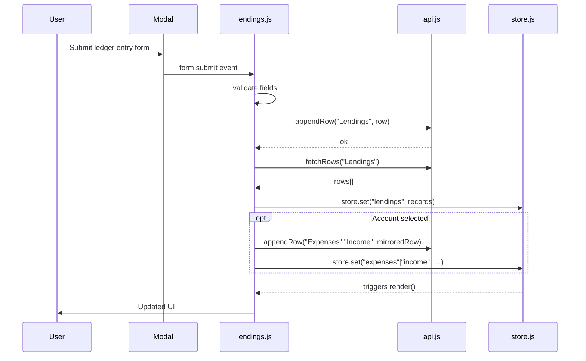

# Design Document: Lending & Borrowing

## Overview

The Lending & Borrowing feature adds a personal ledger to the Expense Portal that tracks money lent to others and money borrowed from others. It follows the same architectural patterns already established in the codebase: a vanilla-JS ES module (`js/lendings.js`), Google Sheets as the backend via `api.js`, an in-memory store via `store.js`, Bootstrap 5 UI with modals and data-card grids, and pagination via `paginate.js`.

Two new Google Sheets tabs are introduced — **Lendings** (ledger entries) and **LendingSettlements** (settlement records). When a user optionally links an account to an entry or settlement, the module writes a *mirrored transaction* into the existing `expenses` or `income` store so that account balances stay accurate without any changes to `accounts.js`.

---

## Architecture

The feature is a self-contained module that integrates with the existing app shell:

```
index.html
  └─ #tab-lendings (new tab pane)
       ├─ Net Summary banner (Total I'm Owed / Total I Owe)
       ├─ Filter bar (status, type)
       ├─ Data-cards grid  ←── js/lendings.js → render()
       └─ Pagination nav

js/lendings.js
  ├─ serialize / deserialize  (LedgerEntry, Settlement)
  ├─ computeOutstanding(entry, settlements)
  ├─ computeStatus(entry, settlements)
  ├─ render()
  ├─ init()
  ├─ _bindLedgerForm()        (modal #oc-lending)
  ├─ _bindSettlementForm()    (modal #oc-settlement)
  ├─ _writeMirroredTx()       (expenses or income store)
  ├─ _deleteMirroredTx()
  └─ _deleteEntry(id)

js/config.js  ← add lendings + lendingSettlements sheet keys
js/store.js   ← add lendings[] + lendingSettlements[] state keys
index.html    ← add sidebar nav item, tab pane, two modals
```

Data flow on save:
1. User fills modal → validation → `appendRow(CONFIG.sheets.lendings, …)` → re-fetch → `store.set('lendings', …)`
2. If account selected → `_writeMirroredTx()` → `appendRow` to expenses or income sheet → re-fetch → `store.set`
3. `store.on('lendings')` and `store.on('lendingSettlements')` trigger `render()`



---

## Components and Interfaces

### `js/lendings.js` — Public API

```js
export function init()    // bind forms, store listeners; called from main app init
export function render()  // re-render cards + summary from store
export function serialize(record)    // LedgerEntry → string[]
export function deserialize(row)     // string[] → LedgerEntry
export function serializeSettlement(record)   // Settlement → string[]
export function deserializeSettlement(row)    // string[] → Settlement
```

### `js/config.js` additions

```js
sheets: {
  // … existing …
  lendings:            'Lendings',
  lendingSettlements:  'LendingSettlements',
}
```

### `js/store.js` additions

Two new keys added to the `state` object:
- `lendings: []`
- `lendingSettlements: []`

### HTML additions

- Sidebar nav button: `data-tab="tab-lendings"`, icon `bi-people-fill`, label "Lendings"
- Tab pane: `id="tab-lendings"`
- Modal `id="oc-lending"` — new/edit ledger entry
- Modal `id="oc-settlement"` — record a settlement

### Mirrored Transaction Interface

`_writeMirroredTx({ type, amount, date, accountRef, note })` returns the `id` of the written record.

- `type === 'lent'` entry → expense row: `{ category: 'Lending', paymentMethod: accountRef, … }`
- `type === 'borrowed'` entry → income row: `{ source: 'Borrowing', receivedIn: accountRef, … }`
- Settlement on `'lent'` entry → income row: `{ source: 'Lending', receivedIn: accountRef, … }`
- Settlement on `'borrowed'` entry → expense row: `{ category: 'Borrowing', paymentMethod: accountRef, … }`

The returned `id` is stored in the `mirroredTxId` field of the ledger entry or settlement row so it can be deleted later.

---

## Data Models

### LedgerEntry (Lendings sheet)

| Column | Field         | Type   | Notes                                      |
|--------|---------------|--------|--------------------------------------------|
| A      | id            | string | `crypto.randomUUID()`                      |
| B      | type          | string | `"lent"` or `"borrowed"`                   |
| C      | counterparty  | string | Person's name                              |
| D      | amount        | number | Original amount (positive)                 |
| E      | date          | string | `YYYY-MM-DD`                               |
| F      | accountRef    | string | Account name or `""` if none               |
| G      | mirroredTxId  | string | ID of mirrored expense/income row or `""`  |
| H      | note          | string | Optional free-text note                    |

```js
// serialize
[id, type, counterparty, String(amount), date, accountRef, mirroredTxId, note]

// deserialize
{
  id:           row[0] ?? '',
  type:         row[1] ?? '',
  counterparty: row[2] ?? '',
  amount:       parseFloat(row[3]) || 0,
  date:         row[4] ?? '',
  accountRef:   row[5] ?? '',
  mirroredTxId: row[6] ?? '',
  note:         row[7] ?? '',
}
```

### Settlement (LendingSettlements sheet)

| Column | Field        | Type   | Notes                                     |
|--------|--------------|--------|-------------------------------------------|
| A      | id           | string | `crypto.randomUUID()`                     |
| B      | entryId      | string | FK → LedgerEntry.id                       |
| C      | amount       | number | Settlement amount (positive)              |
| D      | date         | string | `YYYY-MM-DD`                              |
| E      | accountRef   | string | Account name or `""` if none              |
| F      | mirroredTxId | string | ID of mirrored expense/income row or `""` |
| G      | note         | string | Optional free-text note                   |

```js
// serialize
[id, entryId, String(amount), date, accountRef, mirroredTxId, note]

// deserialize
{
  id:           row[0] ?? '',
  entryId:      row[1] ?? '',
  amount:       parseFloat(row[2]) || 0,
  date:         row[3] ?? '',
  accountRef:   row[4] ?? '',
  mirroredTxId: row[5] ?? '',
  note:         row[6] ?? '',
}
```

### Derived values (computed in-memory, never stored)

```js
// Outstanding balance for a single entry
function computeOutstanding(entry, settlements) {
  const settled = settlements
    .filter(s => s.entryId === entry.id)
    .reduce((sum, s) => sum + s.amount, 0);
  return Math.max(entry.amount - settled, 0);
}

// Status string
function computeStatus(entry, settlements) {
  const outstanding = computeOutstanding(entry, settlements);
  if (outstanding === 0) return 'settled';
  if (outstanding < entry.amount) return 'partial';
  return 'outstanding';
}
```

### Expense mirrored row (uses existing expenses schema)

```js
// expenses.js serialize expects:
{ date, category, subCategory, amount, description, paymentMethod }
// For a "lent" entry:
{ date, category: 'Lending', subCategory: '', amount, description: `Lent to ${counterparty}`, paymentMethod: accountRef }
```

### Income mirrored row (uses existing income schema)

```js
// income.js serialize expects:
{ date, source, amount, description, receivedIn }
// For a "borrowed" entry:
{ date, source: 'Borrowing', amount, description: `Borrowed from ${counterparty}`, receivedIn: accountRef }
```

---


## Correctness Properties

*A property is a characteristic or behavior that should hold true across all valid executions of a system — essentially, a formal statement about what the system should do. Properties serve as the bridge between human-readable specifications and machine-verifiable correctness guarantees.*

### Property 1: Serialization round-trip

*For any* valid `LedgerEntry` or `Settlement` object, calling `deserialize(serialize(record))` should produce an object deeply equal to the original.

**Validates: Requirements 7.1, 7.2**

---

### Property 2: Entry type is preserved

*For any* ledger entry submitted with type `"lent"` or `"borrowed"`, the deserialized record fetched from the store should have the same type as was submitted.

**Validates: Requirements 1.1, 2.1**

---

### Property 3: Required fields validation

*For any* ledger entry or settlement object where one or more of the required fields (counterparty, amount, date for entries; amount, date for settlements) is empty or missing, the validation function should return invalid and the record should not be appended to the store.

**Validates: Requirements 1.2, 2.2, 3.2**

---

### Property 4: Invalid amount rejected

*For any* amount value that is non-positive (≤ 0) or non-numeric, the validation function should reject it and the store should remain unchanged.

**Validates: Requirements 1.3, 2.3**

---

### Property 5: Note is persisted

*For any* ledger entry or settlement saved with a non-empty note string, the deserialized record retrieved from the store should contain the same note string.

**Validates: Requirements 1.4, 2.4**

---

### Property 6: Outstanding balance invariant

*For any* ledger entry with original amount `A` and any sequence of settlements with amounts `s1, s2, …, sN` (each ≥ 0), `computeOutstanding(entry, settlements)` should equal `max(A - (s1 + s2 + … + sN), 0)`.

**Validates: Requirements 3.6, 5.4**

---

### Property 7: Status computation

*For any* ledger entry and its associated settlements:
- If `computeOutstanding` returns 0, `computeStatus` should return `"settled"`.
- If `computeOutstanding` returns a value strictly between 0 and the original amount, `computeStatus` should return `"partial"`.
- If `computeOutstanding` equals the original amount (no settlements), `computeStatus` should return `"outstanding"`.

**Validates: Requirements 3.4, 3.5**

---

### Property 8: Settlement over-payment rejected

*For any* ledger entry and any proposed settlement amount that exceeds the current `computeOutstanding` value, the validation function should reject the settlement and the store should remain unchanged.

**Validates: Requirements 3.3**

---

### Property 9: Filter returns only matching entries

*For any* set of ledger entries and any filter state (status filter, type filter, or both), the filtered result should contain only entries where every active filter criterion matches, and should contain all entries that match all active criteria.

**Validates: Requirements 4.2, 4.3**

---

### Property 10: Sort order is date descending

*For any* non-empty list of ledger entries passed to the render pipeline, the resulting display order should be sorted by `date` descending (most recent first).

**Validates: Requirements 4.4**

---

### Property 11: Net summary equals sum of outstanding balances by type

*For any* set of ledger entries and settlements, the computed "Total I'm Owed" should equal the sum of `computeOutstanding` for all `"lent"` entries, and "Total I Owe" should equal the sum of `computeOutstanding` for all `"borrowed"` entries.

**Validates: Requirements 5.1, 5.2, 5.4**

---

### Property 12: Mirrored transaction written with correct store, category, amount, and account

*For any* ledger entry or settlement saved with a non-empty `accountRef`:
- A `"lent"` entry → an expense record with `category === "Lending"`, `amount === entry.amount`, and `paymentMethod === accountRef` should appear in the expenses store.
- A `"borrowed"` entry → an income record with `source === "Borrowing"`, `amount === entry.amount`, and `receivedIn === accountRef` should appear in the income store.
- A settlement on a `"lent"` entry → an income record with `source === "Lending"`, `amount === settlement.amount`, and `receivedIn === accountRef` should appear in the income store.
- A settlement on a `"borrowed"` entry → an expense record with `category === "Borrowing"`, `amount === settlement.amount`, and `paymentMethod === accountRef` should appear in the expenses store.

**Validates: Requirements 1.5, 2.5, 3.7, 3.8, 8.1, 8.2, 8.3, 8.4**

---

### Property 13: No mirrored transaction without account reference

*For any* ledger entry or settlement saved with an empty `accountRef`, the expenses store and income store should be unchanged after the save operation.

**Validates: Requirements 8.7, 9.5**

---

### Property 14: Mirrored transaction deleted with parent record

*For any* ledger entry or settlement that has a non-empty `mirroredTxId`, after the parent record is deleted, the expenses or income store should not contain any record with that `mirroredTxId`.

**Validates: Requirements 8.5, 8.6**

---

### Property 15: Deletion removes entry and all its settlements

*For any* ledger entry with associated settlements, after the entry is deleted, neither the entry nor any of its settlements should appear in the store.

**Validates: Requirements 6.1**

---

### Property 16: Account selector options match store

*For any* state of the Accounts store, the options rendered in the account selector dropdown (in both the ledger entry modal and the settlement modal) should exactly match the account names present in the store.

**Validates: Requirements 9.1, 9.2, 9.3**

---

## Error Handling

| Scenario | Behaviour |
|---|---|
| API error on save (entry or settlement) | Show inline error banner inside the modal; keep modal open; do not update store |
| API error on delete | Show error message (alert or banner); leave entry intact in UI and store |
| API error on initial fetch | Show global error banner; set store to `[]`; render empty list (no crash) |
| Settlement amount > outstanding | Show inline field error; prevent form submission |
| Missing required fields | Show Bootstrap `is-invalid` feedback on each offending field |
| Non-positive / non-numeric amount | Show `is-invalid` feedback on the amount field |
| Accounts store empty | Hide account selector `<select>` element (add `d-none`); do not render empty `<optgroup>` |
| `mirroredTxId` not found on delete | Log warning to console; continue with entry/settlement deletion (do not block) |

All API calls follow the existing pattern: `try { … } catch (err) { showError(err.message) }`. The module never uses `window.alert` for API errors — it uses the same inline banner pattern as `expenses.js`.

---

## Testing Strategy

### Dual Testing Approach

Both unit tests and property-based tests are required. They are complementary:
- **Unit tests** cover specific examples, integration points, and edge cases.
- **Property-based tests** verify universal correctness across randomly generated inputs.

### Property-Based Testing

**Library**: [fast-check](https://github.com/dubzzz/fast-check) (JavaScript, works in browser and Node environments).

Each property-based test must run a **minimum of 100 iterations** (fast-check default is 100; set `numRuns: 100` explicitly).

Each test must include a comment tag in the format:
```
// Feature: lending-borrowing, Property N: <property text>
```

Each correctness property listed above must be implemented by exactly **one** property-based test.

Example skeleton:

```js
import fc from 'fast-check';
import { serialize, deserialize } from '../js/lendings.js';

// Feature: lending-borrowing, Property 1: Serialization round-trip
test('serialize/deserialize round-trip for LedgerEntry', () => {
  fc.assert(fc.property(
    fc.record({
      id:           fc.uuid(),
      type:         fc.constantFrom('lent', 'borrowed'),
      counterparty: fc.string({ minLength: 1 }),
      amount:       fc.float({ min: 0.01, max: 1_000_000 }),
      date:         fc.date().map(d => d.toISOString().split('T')[0]),
      accountRef:   fc.string(),
      mirroredTxId: fc.string(),
      note:         fc.string(),
    }),
    (record) => {
      expect(deserialize(serialize(record))).toEqual({
        ...record,
        amount: parseFloat(String(record.amount)) || 0,
      });
    }
  ), { numRuns: 100 });
});
```

### Unit Tests

Unit tests should focus on:
- **Specific examples**: a known lent entry with known settlements produces the expected outstanding balance.
- **Integration points**: saving an entry with an account ref results in the correct mirrored transaction in the store.
- **Edge cases**:
  - Settlement exactly equal to outstanding → status becomes `"settled"`.
  - API fetch error → store stays empty, no exception thrown.
  - Accounts store empty → account selector is hidden.
  - `mirroredTxId` missing on delete → deletion still completes.
  - Entry with zero settlements → status is `"outstanding"`.

### Test File Location

```
tests/
  lendings.unit.test.js      — unit tests
  lendings.property.test.js  — property-based tests (fast-check)
```
